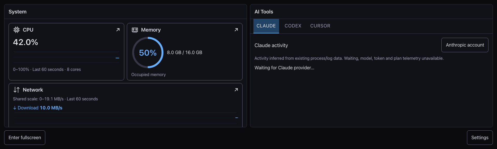

# SideDeck

A secondary-display dashboard for Mac system metrics and AI activity, built with Tauri, Rust, React, and TypeScript.

[中文](README.md) · [GitHub](https://github.com/raymanzhang/SideDeck) · [Privacy](PRIVACY.md) · [Contributing and issue reports](CONTRIBUTING.md)



The screenshot uses synthetic test data, not hardware or authenticated account acceptance evidence.

## Features

- CPU, memory, storage, network, battery, and available temperature metrics with details.
- Claude/Codex sessions and account panels, subject to CLI, account, and background-service capabilities.
- Adjustable layout and interface size, always-on-top, display selection, native fullscreen, and launch at login.
- An About page with version, source links, and the full offline AGPL license.

## Installation and support status

The planned first version is `0.1.0-alpha.1`. No public installation package has completed acceptance. **macOS 13.3 is a design compatibility target, not tested runtime support; actual older-system validation is left to users.** Apple Silicon and Intel builds are planned separately; compilation does not establish runtime support. See the limitations below and the [changelog](CHANGELOG.md).

Once released, choose the labelled architecture DMG from [Releases](https://github.com/raymanzhang/SideDeck/releases), compare its SHA-256 with the published checksum, open it, drag SideDeck into Applications, and launch from Finder. Only architectures with signed, notarized, downloaded-package acceptance may be published. Do not disable Gatekeeper to bypass a failure.

## CLI prerequisites and configuration

CLI discovery checks the launch `PATH`, `~/.local/bin`, `/opt/homebrew/bin`, and `/usr/local/bin`. Set `SIDEDECK_CLAUDE_PATH` or `SIDEDECK_CODEX_PATH` to an absolute executable path for another location. Install and log into each CLI separately. Claude session discovery requires `claude agents --json`; Codex uses `codex app-server proxy`, requiring compatible interfaces and an available background service. `CODEX_HOME` overrides the default `~/.codex` data directory. Claude logs are under `~/.claude/projects`; account access also requires the Keychain OAuth item and network access.

Finder's PATH may differ from the terminal. Standard-directory resolution is implemented; final signed-package Finder acceptance remains pending. Overrides must be set in the GUI launch environment; terminal shell startup files do not automatically configure Finder. Standard installs need no override. Terminal development builds help diagnosis but do not replace installed-package acceptance. Missing login, unsupported interfaces, and denied permissions can make data unavailable. No CLI combination is currently qualified through a signed installation package.

## Development and validation

Use Node 26.7.0 from `.nvmrc`, Rust 1.95.0 from `rust-toolchain.toml`, and Xcode command-line tools.

```sh
npm ci
npx playwright install chromium webkit
npm run tauri dev
```

```sh
npm test
npm run test:release
npm run test:browser
npm run build
cargo test --locked --manifest-path src-tauri/Cargo.toml
npm run tauri -- build -- --locked
```

Local builds are not signed/notarized public releases. Use `npm run dev` for browser preview; native window features require the desktop app.

## Limitations and licensing

Temperature depends on available sensors and may be unavailable. Other sensors are not presented as CPU temperature. Cursor remains a placeholder. Minimum-system, Intel, Finder, authenticated accounts, upgrades, and T8 fullscreen/Spaces/sleep/scaling/display-unplug recovery acceptance are incomplete. SideDeck is not fully offline; read the [privacy document](PRIVACY.md).

The app retains `com.syshud.app`, `sys-hud:*`, and `sys-hud://*` for preference/cache compatibility. The diagnostic variable remains `SYSHUD_WINDOW_TRACE`. See the [brand record](assets/brand/README.md).

Copyright © 2026 Rayman Zhang · [AGPL-3.0-only](LICENSE). Third-party dependencies retain their respective licenses.
